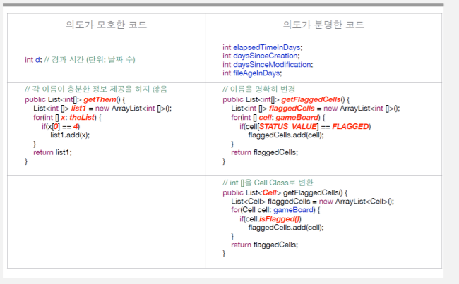

# 클린코드(Cleancode)

## 1. 클린코드의 정의

- 코드를 작성한 의도와 목적이 명확하며 다른 사람이 쉽게 읽을 수 있어야 한다.
- 코드의 가독성이 좋다는 것은 다른 사람이 이해하는데 들이는 시간을 최소화하는 방식으로 작성된다는 것을 의미.

## 2. 클린코드의 필요성

- 개발과정에서 코드를 읽고 쓰는 비율이 10: 1
- 읽기 비율이 높기 때문에 읽기 쉬운 코드는 개발자에게 매우 중요

## 3. 클린코드를 만드는 규칙

### 3-1. 의미 있는 이름(Naming)



- 코드 상에 나만 아는 숫자나 추상적인 변수명을 쓰지 않는다.

Smell_Code.java

```java
if (count > 25) {                        // 25의 의미를 알수없음
 return;
}
```

```java
// i,j,k가 혼동을 줄 수 있으므로, club_i, member_j, user_k 처럼 구분짓는다.
for (int i = 0; i < clubs.size(); i++)
	 for (int j = 0; j < clubs[i].members.size(); j++)
		 for (int k = 0; k < users.size(); k++)
			 if (clubs[i].members[k] == users[j])
					 cout << "user[" << j << "] is in club[" << i << "]" << endl;
```

### 3-2. 명확하고 간결하게 주석달기 (Comment)

- 주석은 최대한 간결하고 명확하게 작성
- 필요 없는 주석이나 이상한 주석은 코드를 읽는 것을 더 어렵게 한다.
- 주석을 달기보다 코드를 명확하게 수정하는 것도 좋은 방법

### 3-3. 보기좋게 배치하고 꾸며라 (Aesthetics)

Smell_code


- ExpandFullName(database, ... ) 구문이 반복
- 코드가 줄이 넘어서 한눈에 보기 힘듬

CleanCode


### 3-4. 착한 함수 (Function)

- 함수를 만드는 가급적 작게 만들고 하나당 하는 일은 하나만 하도록 한다.
- if문이나 While문 안의 내용은 한 줄로 처리되는 것이 이상적이고, 블록 안에서 다른 함수를 호출하도록 작성한다.
- 하나의 일은 같은 추상화 수준을 의미한다.
- 예를 들어, getHtml()은 높은 추상화라면, .append("\n")는 낮은 추상화로 추상화 수준이 다른 것을 혼용하여 사용한다면 읽기가 어려워진다.

Smell_Code


CleanCode


위의 함수는 추상화 수준이 섞여있다. ( For 문과 블록안의 명령문들)

아래는 takeOutTheTrash(), walkTheDog() 처럼 추상화 수준을 맞췄다.

- 함수의 인수(Parameter)는 적을수록 좋다.
- 함수의 인수가 많으면 테스트 케이스를 작성하기도 어려워진다.
- 만약 3개 이상의 인수가 필요하다면 객체 사용을 고려하도록 한다.


- 함수를 만들 때 중복이 없도록 한다.
- 변경 시, 여러 부분에 손을 대야하고 오류가 발생할 확률도 그 만큼 높아짐


### 3-5. 읽기 쉽게 흐름제어 만들기 (Making control flow eazy to read)

- 조건, 루프, 흐름을 통제하는 선언문이 코드에 있으면 코드를 읽기가 어려워진다.
- if/else 조건문에서 인수의 순서는 긍정적이고, 간단하고, 흥미로운 표현이 앞쪽으로 오도록 한다.
- A는 긍정적 질문을 받고, 흥미로운 표현을 앞쪽에 두고, B는 비교적 대상이 부정적으로 사용되고, 궁금한 것을 뒤에 두었다.
- A가 읽기가 더 수월하다.


- 삼항연산자(? :) 나 do/while 구문은 코드의 가독성을 떨어뜨리기 때문에 되도록 사용하지 않는 것이 바람직
- 삼항연산자는 매우 간단할 경우에 한해 필요하다면 사용
- do/ while 은 역순으로 읽어야되기 때문에 부자연스러운 흐름을 만든다.
- if/else 구문은 중첩이 깊어지면 코드를 이해하기 어려워진다.

Smell Code


Clean Code


- if/else가 중첩되면서 user_result와 permission_result의 결과를 저장한 채로 코드를 읽어나가야 한다.
- 이런 경우 함수 중간에서 변환하여 중첩을 제거함으로서 한 단계의 중첩만 가지도록 변경한다.

## 3-6 오류처리(Error handling)

- 오류처리를 위해 중첩된 if문을 남발하기 보다는 예외(exception)을 적극 활용한다.

Smell Code


Clean Code


- 정상적인 인수로 null을 기대하는 API가 아니라면 메서드로 null을 전달하는 코드는 최대한 피해야 한다.
- null을 반환하는 코드는 아래코드 처럼 null 체크코드가 필요하다.


## Refference

- 클린코드 part1 : 적용과 개선 - 깨끗한 코드를 만들기 위한 방법 -
- [클린코드 part2 : 적용과 개선 - 깨끗한 코드를 만들기 위한 방법 -](http://kosta.or.kr/mail/2015/download/CleanCode_Part2.pdf)